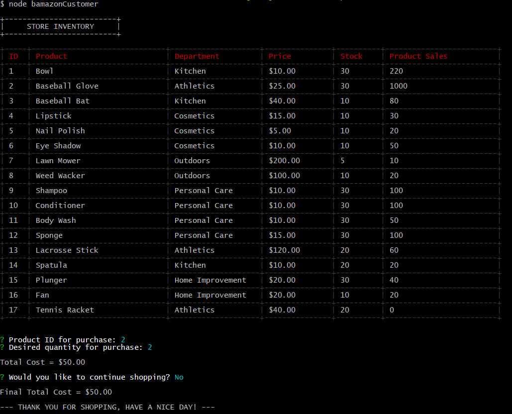
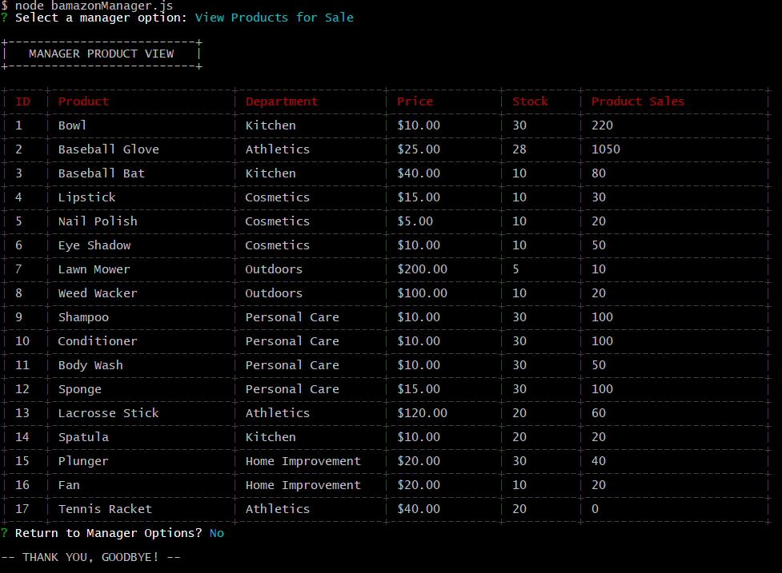
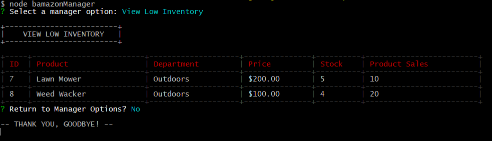
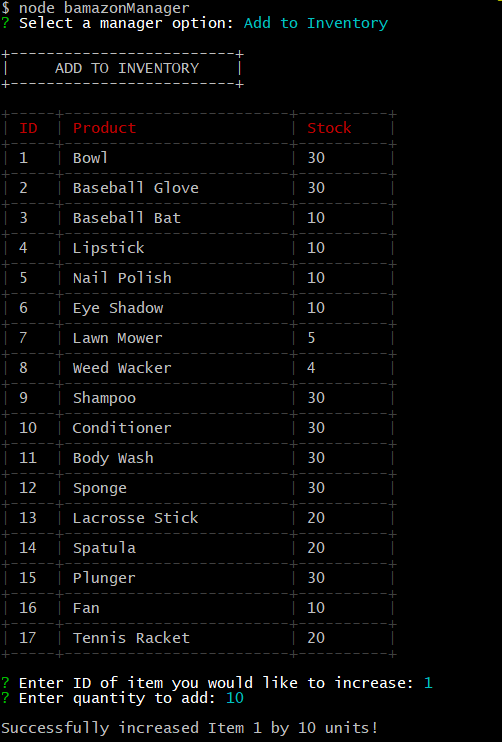
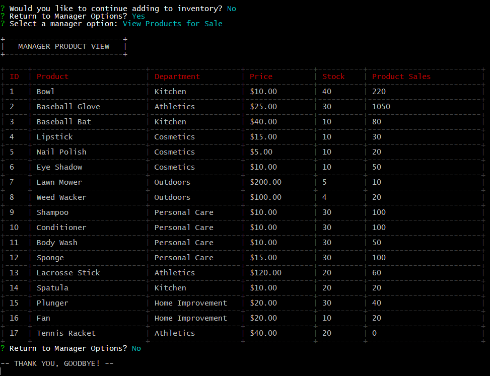
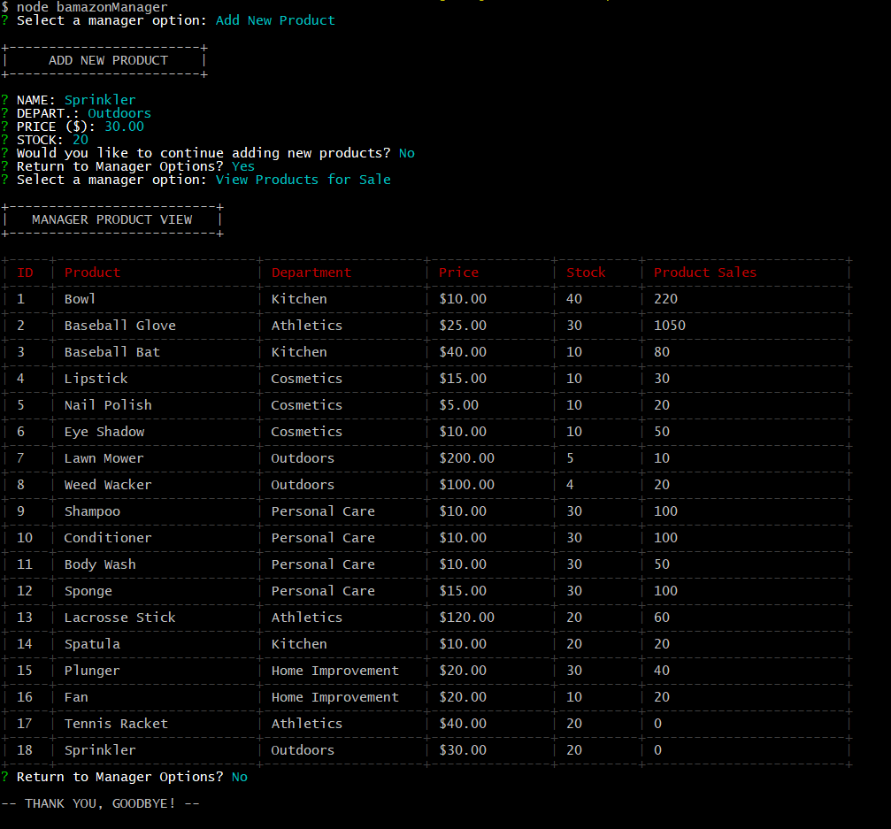
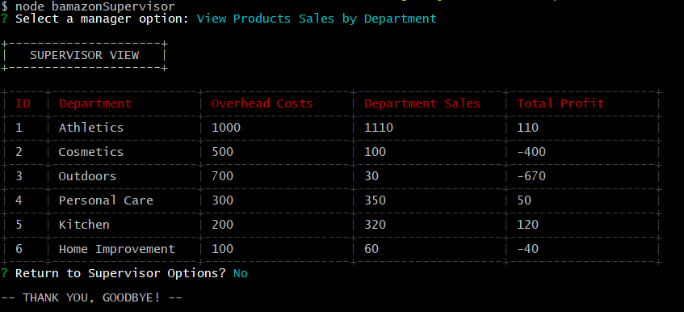
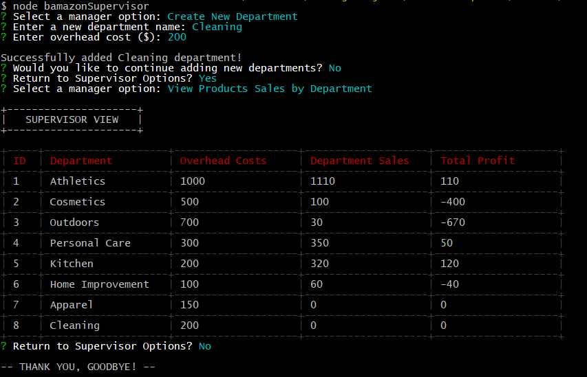

# Bamazon
An amazon-esk store application with a simple command line GUI that uses MySQL to hold the store catalog's data.

## Introduction
To begin `npm install` to install all major dependencies. Then select the user typeas show in the examples for each user type (see *Table of Contents*).

## Table of Contents
1. [Bamazon Customer](#bamazon-customer)
2. [Bamazon Manager](#bamazon-manager)
3. [Bamazon Supervisor](#bamazon-supervisor)
4. [config.js](#config-js)
5. [SQL Tables](#sql-tables)

## Bamazon Customer <a name="bamazon-customer"></a>
The `bamazonCustomer` has access to **one** methods
- [Commence Shop](#customer-commenceShop-method)

#### Commence Shop <a name="customer-commenceShop-method"></a>
The customer is presented with the products available for sale and selects
the product they wish to purchase via it's product ID. The customer is also
prompted to specify they quantity of said product. Once the user has been
made their selection they are prompted whether they wish to continue shopping
or checkout.

Example of *Commence Shop*:




## Bamazon Manager <a name="bamazon-manager"></a>
The `bamazonManager` has access to **four** methods:
- [View Products](#manager-viewProducts-method)
- [View Low Inventory](#manager-viewLowInventory-method)
- [Add to Inventory](#manager-addToInventory-method)
- [Add New Product](#manager-addNewProduct-method)

#### View Products <a name="manager-viewProducts-method"></a>
Allows the manager to view a list of available products to the customer. From this method the manager can return to the manager options menu or quit the application.

Example of *View Products*:



#### View Low Inventory <a name="manager-viewLowInventory-method"></a>
Allows the manager to view a list of products that have a stock less-than-or-equal-to five (stock <= 5). From this method the manager can return to the manager options menu or quit the application.

Example of *View Low Inventory*:



#### Add to Inventory <a name="manager-addToInventory-method"></a>
Allows the manager to increase the available stock of an item to customers. From this method the manager can return to the manager options menu or quit the application.

Example of *Add to Inventory* (before adding stock to *bowls*):



Example of *Add to Inventory* (after adding stock to *bowls*):



#### Add New Product <a name="manager-addNewProduct-method"></a>
Allows the manager to add a new product to the list of available products for
the customer. The manager must provide the products name, price, and stock as well as selecting the department the product belongs in from a *departments* list. From this method the manager can return to the manager options menu or quit the application.

Example of *Add New Product*:

*Update*: The manager now receives a notification that says the new product was successfully added.



## Bamazon Supervisor <a name="bamazon-supervisor"></a>
The `bamazonSupervisor` has access to **two** methods:
- [View Products Sales By Department](#manager-viewProductSales-method)
- [Add New Department](#supervisor-addNewDepartment-method)

#### View Product Sales By Department <a name="supervisor-viewProductSales-method"></a>
Allows the supervisor to see the total sales made from each department. The table displays the `overhead cost` of each department and the `total profit` by finding the quotient of `overhead costs` and `department sales`. From this method the manager can return to the supervisor options menu or quit the application.

Example of *View Product Sales By Department*:




#### Add New Department <a name="supervisor-addNewDepartment-method"></a>
Allows the supervisor to create a new department. The new department is then available to the manager as a selectable department when adding a new product to the products catalog. From this method the manager can return to the supervisor options menu or quit the application.

Example of *Add New Department*:



## config.js <a name="config-js"></a>

In order for a user to run the program using their own SQL database setup, a `config.js` file must be added to the root directory of the application. `config.js` should consist of an exported object that is structured in the following manner:

```
module.exports = {
  host: "localhost" <or other host>,
  port: <insert port here>,
  user: <insert sql server username>,
  password: <insert sql server password>,
  database: "bamazon_db"
};
```

## SQL Tables <a name="sql-tables"></a>
Inside the application's `/sql_tables` directory reside the queries for creating the example tables seen in the demos. The user may create their own tables with different product entries if they choose, however for the application to work, the names used for the columns must match those in the SQL files provided.

Running the SQL queries provided with delete `departments` and `products` tables if they already exist in the established server.
